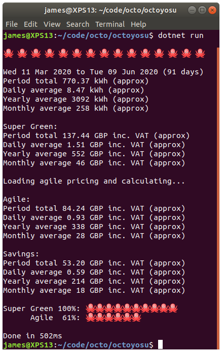
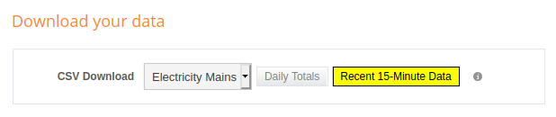

# Octoyosu

Octoyosu is a small command line tool that works out how much you would save on the [Octopus Energy Agile](https://octopus.energy/agile/) tariff.
It takes historical readings from an energy logger and combines this with pricing data to calculate savings information (with the Octopus Super Green tariff as a baseline).

Agile Octopus is a 100% green electricity tariff that regularly _pays you_ to consume electricity.
Welcome to the future.

If you are not already living in the future then you can switch to Octopus Energy and get [£50 credit with this referral link](https://share.octopus.energy/witty-wave-889).

You may also like [OctoPlot](https://github.com/jpsingleton/octoplot), a small command line tool that draws a graph of the Octopus Energy Agile pricing in your terminal.

## Examples



```text
🐙 🐙 🐙 🐙 🐙 🐙 🐙 🐙 🐙 🐙 🐙 🐙 🐙 🐙 🐙

Wed 11 Mar 2020 to Tue 09 Jun 2020 (91 days)
Period total 770.37 kWh (approx)
Daily average 8.47 kWh (approx)
Yearly average 3092 kWh (approx)
Monthly average 258 kWh (approx)

Super Green:
Period total 137.44 GBP inc. VAT (approx)
Daily average 1.51 GBP inc. VAT (approx)
Yearly average 552 GBP inc. VAT (approx)
Monthly average 46 GBP inc. VAT (approx)

Loading agile pricing and calculating...

Agile:
Period total 84.24 GBP inc. VAT (approx)
Daily average 0.93 GBP inc. VAT (approx)
Yearly average 338 GBP inc. VAT (approx)
Monthly average 28 GBP inc. VAT (approx)

Savings:
Period total 53.20 GBP inc. VAT (approx)
Daily average 0.59 GBP inc. VAT (approx)
Yearly average 214 GBP inc. VAT (approx)
Monthly average 18 GBP inc. VAT (approx)

Super Green 100%: 🐙🐙🐙🐙🐙🐙🐙🐙🐙🐙
      Agile  61%: 🐙🐙🐙🐙🐙🐙

Done in 502ms
```

## Usage

Download the [Octopus Agile tariff pricing data for your region from energy-stats.uk](https://www.energy-stats.uk/download-historical-pricing-data/).

Download your usage readings, e.g. [Recent 15-Minute Data from geo energynote](https://www.energynote.eu/services/).



The geo export file looks like this:

```csv
Date (yyyymmdd hh:mm),Cost (£),Extra Cost (£),Consumption (kWh),Carbon (kg)
20201005 00:00,0.00216,0.00000,0.02000,0.01074
20201005 00:15,0.00648,0.00000,0.06000,0.03222
```

Only columns 1 and 4 are used.

If you download the usage readings from a smart meter, [OpenEnergyMonitor](https://openenergymonitor.org/) or a homemade [Raspberry Pi Electricity Monitor](https://unop.uk/raspberry-pi-electricity-monitor) etc. then you will probably need to tweak the code to match the CSV format.

Clone the repository
(you will need the [.NET (Core) SDK](https://dotnet.microsoft.com/download) installed).

```bash
git clone git@github.com:jpsingleton/octoyosu.git
```

Copy both CSV files to the octoyosu directory.

_Optional_: Tweak the tariff baseline constants to what you currently pay if not Octopus Super Green (100% green electricity and offset gas).

Run the tool.

```bash
dotnet run
```

You can also specify the paths to the files manually (and run in Release mode to remove the execution time info).

```bash
dotnet run ~/Downloads/detailedReadings.csv ~/Downloads/csv_agile_J_South_Eastern_England.csv -c Release
```

## Limitations

If you are using a current clamp logger then the exact values may not be accurate. The relative percentages will be correct but the kWh and £ GBP values require data directly read from the meter to be precise (e.g. a smart meter). 

## License

Licensed under the [EUPL-1.2-or-later](https://joinup.ec.europa.eu/collection/eupl/introduction-eupl-licence)

This project is _treeware_! If you found it useful then please [plant a tree for me](https://offset.earth/unitsetsoftware).

[](https://offset.earth/unitsetsoftware)
